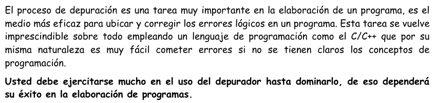

= Unofficial repository for past LP1 test solutions
Mitsuo
2022-09-09
:source-highlighter: highlight.js

Contributions are very welcomed and needed, if you want to contribute
please open a Pull Request following the directory structure:

An effort is made to have the code be concise and readable.

 semester/L#/submitter's name/

NOTE: I won't include the PDFs with the problem statement because I don't have
permission to share them publicly on the internet.  If you have a PUCP
email, you can either access
https://drive.google.com/drive/folders/1RKKsj1GRmz3iO7aCXjGH1Rhiz9sD0eCZ?usp=drive_link[Prof. Cueva's Google Drive] or
https://facultad.pucp.edu.pe/ingenieria/agrupaciones/asociacion-alumnos-ingenieria-informatica-aaii-pucp/[AAII]'s
https://drive.google.com/drive/folders/0B8DUIB5m9fukVHZhX1pRZFhHY2M?resourcekey=0-_ODdPfSHMCyE6heWHij3Hg&usp=drive_link[Google Drive]
, you can find the some PDFs there.

== Tips

=== Incremental development

Many times, compilation or runtime error messages are not helpful or
borderline cryptic.  Debugging tools help a lot.  But narrowing down what
component most likely failed is of **great** help.  Develop each "module"
separately, compile and debug frecuently.  Make sure each "module" works OK
before beginning the next.

=== Debugging

You should definitly make effective use the debugging tools from the IDE
(breakpoints, keybindings, call stack, watches, expressions).
Otherwise you are just waisting your time.  Most IDE either use
https://en.wikipedia.org/wiki/GNU_Debugger[GDB] or
https://en.wikipedia.org/wiki/LLDB_(debugger)[LLDB], and they share most of the
basic concepts.  You can https://www.youtube.com/watch?v=Dq8l1_-QgAc[learn the basics] 
fast and start **practicing**.

Prof. Guanira states it clearly in "Guia de Creacion Ejecucion y
Depuracion.pdf":

=== Formatting

Using
https://cplusplus.com/reference/library/manipulators/[
stream manipulators] and
https://cplusplus.com/reference/ios/ios_base/fmtflags/[
stream format flags] can be cumbersome, but the course _requires_ them since
using `printf` is not allowed. So maybe macros can be helpful here.

See link:tips/formatting.adoc[] for an example implementation and usage.
